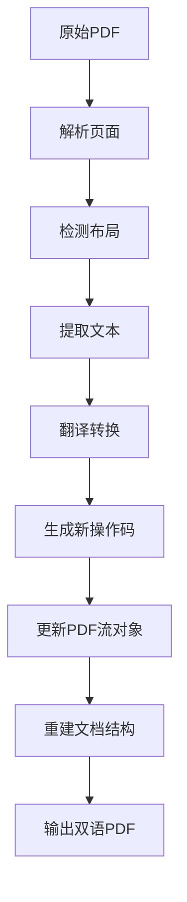

### 目的
研究开源项目pdf底层原理

### 流程

```mermaid
graph TD
    A[原始PDF] --> B[解析页面]
    B --> C[检测布局]
    C --> D[提取文本]
    D --> E[翻译转换]
    E --> F[生成新操作码]
    F --> G[更新PDF流对象]
    G --> H[重建文档结构]
    H --> I[输出双语PDF]
          
          
```

