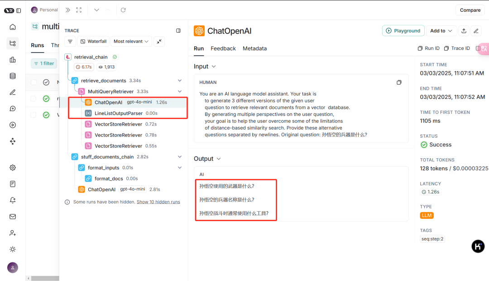
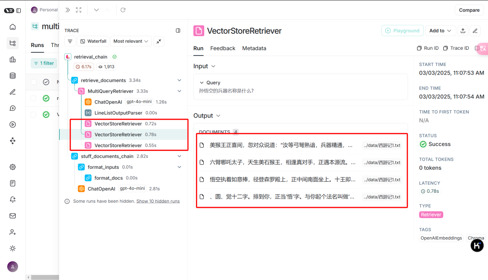
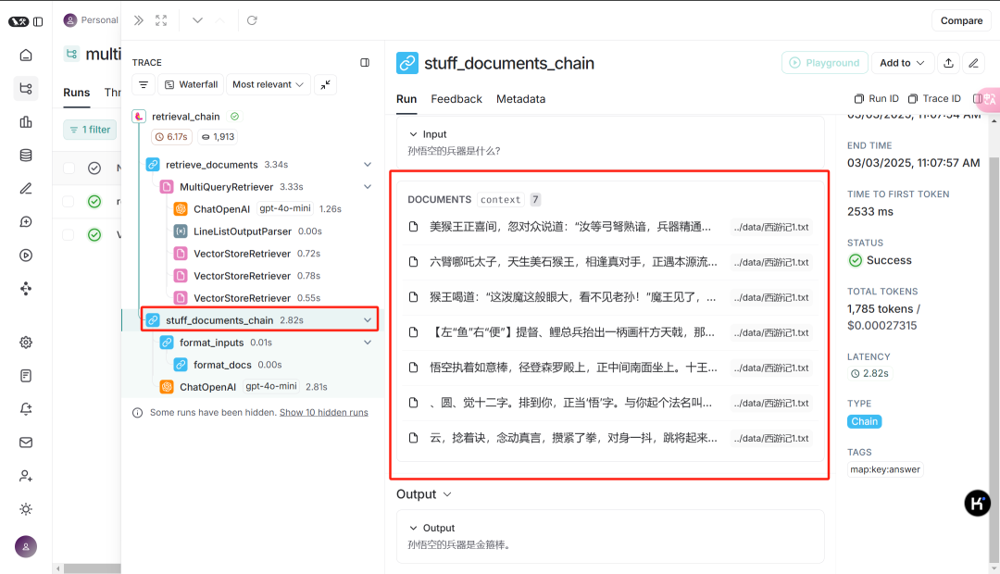

## 召回增强
出处：https://mp.weixin.qq.com/s/OKCqxMW0aqLFp9R_alOToA

langchain的MultiQueryRetriever是一种增强检索工具，用于解决长文档检索时上下文丢失（？？）的问题,从而提高召回率

ParentDocumentRetriever 是一种分层检索方式，在子文档中检索，返回完整的父文档。 （主要解决保证检索结果的上下文完整性）

主要解决：
1. 表述不统一：用户表述不明确，召回不命中，例如“人工智能的发展趋势”可以表述为“AI 未来的发展方向”。
2. 召回率低：不同向量模型导致召回不命中，无法检索到相关文档。
3. 无法处理语义上的遍体：单一查询丢失与该查询不同表述但语义相关的文档。比如食谱中，分块1:讲述童年里的糖葫芦，分块2:讲述山楂制作成糖葫芦(该分块没有提及糖葫芦)

实现思路：
1. 查询生成器（LLM 生成）：使用大模型（如 OpenAI GPT）基于用户输入生成多个查询变体。
2. 检索（Retriever）：将这些查询分别提交给底层的Retriever，获取相关文档。
3. 合并结果：对多个查询返回的结果去重、排序，以确保最终返回的文档质量更高。

方案：
可以将MultiQuery和ParentDocument结合

代码：
```angular2html
# 导入操作系统接口模块
import os

# 设置OpenAI API密钥
OPENAI_API_KEY = 'hk-iwtba91e427'
# 将API密钥设置为环境变量
os.environ['OpenAI_API_KEY'] = OPENAI_API_KEY

# LangSmith 环境变量 (可选) ,如果需要使用 LangSmith 功能，请在环境变量中设置以下变量
os.environ['LANGCHAIN_TRACING_V2'] = "true"
os.environ['LANGCHAIN_ENDPOINT'] = "https://api.smith.langchain.com"
os.environ['LANGCHAIN_API_KEY'] = "lsv2_pt_00d1ec513"
os.environ['LANGCHAIN_PROJECT'] = "multi_query"


# Build a sample vectorDB
from langchain_chroma import Chroma
from langchain_community.document_loaders import WebBaseLoader,TextLoader
from langchain_openai import OpenAIEmbeddings
from langchain_text_splitters import RecursiveCharacterTextSplitter

# 创建文本加载器，加载西游记文本文件
loader = TextLoader(file_path="../data/西游记1.txt", encoding='utf-8')
# 加载文档内容
data = loader.load()

print(f'一共 {len(data)} 个文档')  # 打印加载的文档数量
print(f'一共 {len(data[0].page_content)} 个字符')  # 打印第一个文档的字符数

# 分块
text_splitter = RecursiveCharacterTextSplitter(chunk_size=500, chunk_overlap=40)
splits = text_splitter.split_documents(data)


# 导入操作系统接口模块
import os

# 设置OpenAI API密钥
OPENAI_API_KEY = 'hk-iwtba91e427'
# 将API密钥设置为环境变量
os.environ['OpenAI_API_KEY'] = OPENAI_API_KEY

# LangSmith 环境变量 (可选) ,如果需要使用 LangSmith 功能，请在环境变量中设置以下变量
os.environ['LANGCHAIN_TRACING_V2'] = "true"
os.environ['LANGCHAIN_ENDPOINT'] = "https://api.smith.langchain.com"
os.environ['LANGCHAIN_API_KEY'] = "lsv2_pt_00d1ec513"
os.environ['LANGCHAIN_PROJECT'] = "multi_query"


# Build a sample vectorDB
from langchain_chroma import Chroma
from langchain_community.document_loaders import WebBaseLoader,TextLoader
from langchain_openai import OpenAIEmbeddings
from langchain_text_splitters import RecursiveCharacterTextSplitter

# 创建文本加载器，加载西游记文本文件
loader = TextLoader(file_path="../data/西游记1.txt", encoding='utf-8')
# 加载文档内容
data = loader.load()

print(f'一共 {len(data)} 个文档')  # 打印加载的文档数量
print(f'一共 {len(data[0].page_content)} 个字符')  # 打印第一个文档的字符数

# 分块
text_splitter = RecursiveCharacterTextSplitter(chunk_size=500, chunk_overlap=40)
splits = text_splitter.split_documents(data)


import logging

logging.basicConfig()
logging.getLogger("langchain.retrievers.multi_query").setLevel(logging.INFO)

from langchain.chains import create_retrieval_chain
from langchain.chains.combine_documents import create_stuff_documents_chain
from langchain_core.prompts import PromptTemplate
PROMPT = PromptTemplate.from_template("""
上下文信息如下
---------------------
{context}
---------------------
请根据以上提供的上下文信息，不依赖其他外部知识，回答以下问题
问题: {input}
答案:
""")

question_answer_chain = create_stuff_documents_chain(llm, PROMPT)
rag_chain = create_retrieval_chain(multi_retriever, question_answer_chain)
response = rag_chain.invoke({"input": question})

print(response)
```


看到MultiQueryRetriever根据用户问题“孙悟空的兵器是什么?”，生成3个相关查询变体


根据3个不同的查询变体，检索到对应的文档内容



把所有检索到的文档经过剔重后作为上下文，通过LangChain链生成最终答案
